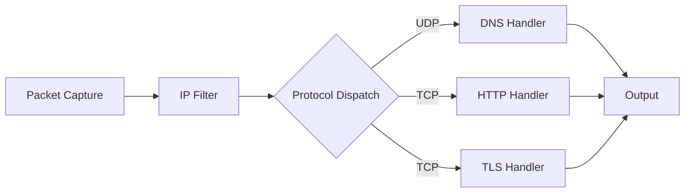

# Argus

> Passive network sniffer with deep packet inspection for HTTP, TLS, and DNS


Network monitoring tools like Wireshark tell you what port something runs on. I wanted to build something smarter, a sniffer that identifies protocols by reading the actual bytes, catching HTTP servers hiding on port 8080 or DNS on 5353. Argus detects HTTP, TLS, and DNS through deep packet inspection, regardless of port.

## What It Does

Argus captures network traffic (live or from pcap files) and classifies each packet by its actual protocol content, not by port number. A DNS query on port 5353 is still DNS. An HTTP server on port 9090 is still HTTP. A TLS handshake on port 993 is still TLS.

It flags two security-relevant patterns automatically: automation tools (curl, wget, python-requests, httpx) generating HTTP traffic, and DNS lookups for internal infrastructure domains (.local, .corp, .internal) that may indicate information leakage.

## Architecture



Packets enter through Scapy's `sniff()`, either from a live interface or a pcap file. The dispatch loop iterates through handlers in order (DNS, HTTP, TLS) and stops at the first match. Each handler returns either a parsed detail string or `None` to pass to the next handler.

## Features

**Port-independent protocol detection.** Every handler inspects raw payload bytes rather than relying on well-known port numbers. DNS queries are identified by their wire format (12-byte header + question section). HTTP is matched by request line prefixes (`GET `, `POST `, `PUT `). TLS is matched by the record layer header byte `0x16` followed by version bytes `0x03 0x0N` and handshake type `0x01`.

**TLS SNI extraction with binary fallback.** Argus tries three strategies to extract the Server Name Indication from a TLS ClientHello. First, it checks if Scapy's TLS layer parsed a `TLSClientHello` with a `TLS_Ext_ServerName` extension. Second, if raw bytes are available, it attempts to construct a `TLS()` object and parse it. Third, if both fail, a manual binary parser walks the ClientHello structure byte by byte: skipping the 5-byte record header, 4-byte handshake header, 2-byte version, 32-byte random, variable-length session ID, cipher suites, and compression methods to reach the extensions block, then scans for extension type `0x0000` (server_name) and extracts the hostname.

**Automation detection.** HTTP requests with User-Agent strings matching known automation tools (curl, wget, python-requests, python-urllib, python-httpx, libwww-perl, go-http-client, httpie) are flagged with `AUTOMATION` and the full User-Agent string. This surfaces scripted or bot traffic that may warrant further investigation.

**Internal infrastructure flagging.** DNS lookups for domains ending in `.local`, `.corp`, or `.internal` are tagged with `INTERNAL`. These are non-routable TLDs that should never appear in queries to external resolvers, and their presence in captured traffic can indicate misconfigured systems or DNS leakage.

## Usage

**Live capture** (requires root for raw socket access):

```bash
sudo python3 argus.py -i eth0
```

**Read from a pcap file:**

```bash
python3 argus.py -r capture.pcap
```

**Apply a BPF filter:**

```bash
sudo python3 argus.py -i eth0 "host 10.0.0.1 and port 443"
```

## Example Output

Running against the test pcap produces 16 classified packets across all three protocols:

```
DNS  192.168.64.6:46465 -> 8.8.8.8:53       www.example.org
DNS  192.168.64.6:38645 -> 1.1.1.1:5353     www.example.com
DNS  192.168.64.6:49435 -> 8.8.8.8:53       esxi1.local INTERNAL
DNS  192.168.64.6:34553 -> 8.8.8.8:1053     db.corp INTERNAL
DNS  192.168.64.6:36106 -> 192.168.64.1:53  www.example.org
HTTP 192.168.64.6:40378 -> 23.185.0.4:80    www.example.org GET /test/
HTTP 127.0.0.1:55814    -> 127.0.0.1:8080   127.0.0.1:8080 GET /
DNS  192.168.64.6:49840 -> 192.168.64.1:53  www.example.org
HTTP 192.168.64.6:40392 -> 23.185.0.4:80    www.example.org POST /test/ AUTOMATION curl/8.11.1
HTTP 127.0.0.1:36150    -> 127.0.0.1:9090   127.0.0.1:9090 PUT /upload AUTOMATION python-requests/2.31.0
DNS  192.168.64.6:35641 -> 192.168.64.1:53  google.com
DNS  192.168.64.6:60793 -> 192.168.64.1:53  imap.gmail.com
TLS  192.168.64.6:57114 -> 142.251.45.78:443   google.com
TLS  192.168.64.6:46096 -> 172.253.62.109:993  imap.gmail.com
TLS  192.168.64.6:57118 -> 142.251.45.78:443   NO SNI
TLS  192.168.64.6:46098 -> 172.253.62.109:993  NO SNI
```

The test cases cover:

| # | Protocol | Port | Variant | Detail |
|---|----------|------|---------|--------|
| 1 | DNS | 53 | Standard | A record query to 8.8.8.8 |
| 2 | DNS | 5353 | Non-standard | Query to Cloudflare on mDNS port |
| 3 | DNS | 53 | Internal | `.local` domain flagged INTERNAL |
| 4 | DNS | 1053 | Non-standard + internal | `.corp` domain on non-standard port |
| 5 | DNS | 53 | Standard | Pre-resolution lookup for HTTP target |
| 6 | HTTP | 80 | Standard GET | Normal browser request |
| 7 | HTTP | 8080 | Non-standard GET | HTTP server on alternate port |
| 8 | DNS | 53 | Standard | Pre-resolution lookup for HTTP target |
| 9 | HTTP | 80 | Automation POST | curl User-Agent flagged |
| 10 | HTTP | 9090 | Automation PUT | python-requests flagged |
| 11 | DNS | 53 | Standard | Pre-resolution for TLS targets |
| 12 | DNS | 53 | Standard | Pre-resolution for TLS targets |
| 13 | TLS | 443 | Standard + SNI | google.com extracted from ClientHello |
| 14 | TLS | 993 | Non-standard + SNI | imap.gmail.com on IMAPS port |
| 15 | TLS | 443 | Standard + no SNI | ClientHello without server_name extension |
| 16 | TLS | 993 | Non-standard + no SNI | No SNI on non-standard TLS port |

## How It Works

### DNS Detection

DNS uses a fixed binary wire format defined in RFC 1035. Every query starts with a 12-byte header containing a transaction ID, flags, and count fields. Argus first checks if Scapy already parsed a DNS layer and question record (DNSQR). If not, it takes the raw UDP payload and attempts to construct a `DNS()` object from it. This means DNS queries on any UDP port get detected, not just port 53.

The handler filters for queries only (`qr == 0`) and specifically A record lookups (`qtype == 1`). After extracting the queried domain name, it checks against the internal TLD list (`.local`, `.corp`, `.internal`) and appends the `INTERNAL` tag if matched.

### HTTP Detection

HTTP detection uses a two-tier approach. First, Argus checks if Scapy's HTTP dissector already parsed an `HTTPRequest` layer and extracts the method, host, path, and User-Agent from structured fields. If Scapy did not parse it (common on non-standard ports where Scapy does not attempt HTTP dissection), Argus checks the raw TCP payload for request line prefixes (`GET `, `POST `, `PUT `). When a prefix matches, it tries to construct an `HTTPRequest` from the raw bytes. If that also fails, a manual ASCII parser splits the payload on `\r\n`, extracts the method and path from the first line, and builds a header dictionary from subsequent lines.

This layered fallback ensures HTTP detection works regardless of port. A web server running on port 8080 or 9090 produces the same output format as one on port 80.

### TLS Detection and SNI Extraction

TLS detection targets the ClientHello message specifically, since it is the only handshake message sent in cleartext that contains the Server Name Indication (SNI) extension.

The raw byte signature for a TLS ClientHello is: byte 0 is `0x16` (handshake record), bytes 1-2 are `0x03 0x0N` (TLS version in the record layer), and byte 5 is `0x01` (ClientHello handshake type). This five-byte check eliminates non-TLS traffic before any parsing is attempted.

If Scapy's TLS module is available and already decoded a `TLSClientHello`, Argus walks the extensions list looking for `TLS_Ext_ServerName` and extracts the first servername entry. If Scapy did not parse it (the TLS module is an optional dependency), Argus falls back to manual binary parsing.

The manual parser navigates the ClientHello structure using offset arithmetic:

1. Skip the 5-byte record header and 4-byte handshake header to reach the ClientHello body.
2. Skip 2 bytes of protocol version and 32 bytes of client random.
3. Read the session ID length byte and skip that many bytes.
4. Read the 2-byte cipher suites length and skip that many bytes.
5. Read the 1-byte compression methods length and skip that many bytes.
6. Read the 2-byte extensions length to know the boundary.
7. Walk the extensions: each has a 2-byte type and 2-byte length. When type `0x0000` (server_name) is found, check that byte at offset +2 is `0x00` (host_name type), read the 2-byte name length, and decode the hostname bytes.

If no SNI extension is present (as when a client connects with `-noservername`), the output reads `NO SNI`.

## Testing

Argus includes a test pcap generator and a capture script for validating all detection paths.

**Generate a synthetic test pcap:**

```bash
python3 generate_test_pcap.py
```

This creates `test.pcap` with 12 crafted packets covering all protocol and variant combinations.

**Run against the test pcap:**

```bash
python3 argus.py -r test.pcap
```

**Full integration test** (requires a Linux VM with network access):

```bash
sudo bash capture.sh
```

This starts tcpdump, generates live traffic for all 12 test cases (DNS queries, HTTP requests with automation User-Agents, TLS handshakes with and without SNI), merges captures, and runs Argus against the result with verification checks.

## Requirements

- Python 3.11+
- [Scapy](https://scapy.net/) (packet manipulation)
- [cryptography](https://cryptography.io/) (optional, for TLS layer support in Scapy)
- Root/sudo for live capture (pcap file reading does not require root)

```bash
pip install scapy cryptography
```

## Related Projects

Part of a 5-project security research portfolio: [Secure Vault](https://github.com/FardinIqbal/secure-vault) (password manager), [NetSec Toolkit](https://github.com/FardinIqbal/netsec-toolkit) (certificate analyzer), [tcpscan](https://github.com/FardinIqbal/tcpscan) (TCP scanner), [x86 Exploit Lab](https://github.com/FardinIqbal/x86-exploit-lab) (buffer overflow research).
