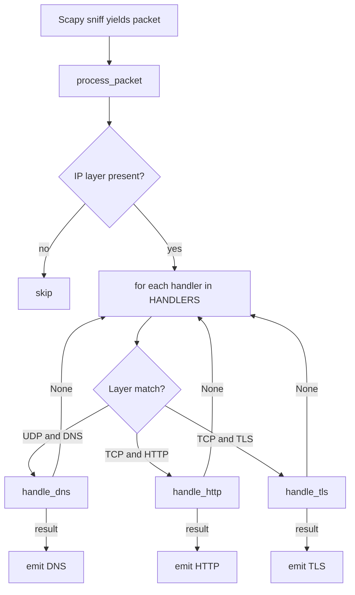

# Architecture

Deep reference for argus. The README covers the protocol detection logic; this doc covers the dispatch design, the fallback strategy, and the performance characteristics.

## Handler dispatch



Handlers are evaluated in order: DNS first, then HTTP, then TLS. Each returns either a parsed detail string or `None`. The first non-`None` result wins; the rest are skipped.

Order matters. UDP packets only match DNS, so that handler runs first to short-circuit. For TCP, HTTP detection runs before TLS because the HTTP method-keyword check is cheaper than the TLS magic-byte check (HTTP needs to compare 4 bytes; TLS needs to verify 5 specific bytes plus walk extensions).

## Fallback parsing strategy

For each protocol, Argus uses a layered approach that tries the cheapest path first and falls back to manual parsing on failure:

### DNS

1. **Scapy's `DNS()` layer**: if Scapy already parsed a DNS layer and a DNSQR (DNS question record) is present, extract the queried name directly.
2. **Manual UDP payload parse**: take the raw UDP bytes and feed them to `DNS()` constructor. This handles non-standard ports where Scapy does not auto-dissect.

### HTTP

1. **Scapy's `HTTPRequest` layer**: if Scapy already parsed it, extract method, host, path, and User-Agent from structured fields.
2. **Raw TCP payload check**: look for `GET `, `POST `, `PUT ` prefix; try to construct `HTTPRequest()` from raw bytes.
3. **Manual ASCII parse**: split on `\r\n`, parse first line for method and path, build a header dict from subsequent lines.

### TLS

1. **Magic-byte check**: byte 0 is `0x16`, bytes 1-2 are `0x03 0x0N`, byte 5 is `0x01`. Eliminates non-TLS in O(1).
2. **Scapy's `TLSClientHello`**: walk the extensions list for `TLS_Ext_ServerName`.
3. **Manual binary parser**: walk the ClientHello structure with `struct.unpack` to find extension type `0x0000` (server_name).

The fallback path matters because Scapy's high-level dissectors are designed for standard ports. Without manual parsing, Argus would miss services on non-standard ports, which is the entire point of the project.

## Manual TLS parser walk

The manual parser navigates the ClientHello using offset arithmetic. Each field is length-prefixed, and getting the offsets wrong reads garbage:

```
Byte 0:    0x16 (record type: handshake)
Byte 1-2:  0x03 0x0N (record layer version)
Byte 3-4:  record length (big-endian uint16)
Byte 5:    0x01 (handshake type: ClientHello)
Byte 6-8:  handshake length (3 bytes)
Byte 9-10: ClientHello version
Byte 11-42: 32-byte client random
Byte 43:   session ID length
Byte 44 to 44+SIDlen: session ID
Then:      cipher suites length (2 bytes), cipher suites bytes
Then:      compression methods length (1 byte), compression bytes
Then:      extensions length (2 bytes), extensions bytes
```

The parser starts at byte 43 (post-fixed-fields) and walks each variable-length section. When it reaches the extensions block, it iterates by reading 4 bytes per extension (2-byte type, 2-byte length), checking for type `0x0000` (server_name).

When server_name is found, the structure inside is:

```
extension data:
  +0: server_name list length (2 bytes)
  +2: name type (1 byte; 0x00 means host_name)
  +3: host_name length (2 bytes)
  +5: host_name bytes
```

The parser reads bytes 5 through 5+host_name_length and decodes them as the SNI hostname.

## Edge cases

| Case | Handling |
|------|----------|
| TLS ClientHello without SNI extension | Returns `"NO SNI"` |
| TLS ClientHello with malformed extension | Returns `"NO SNI"` (caught by try/except) |
| Non-A-record DNS query (AAAA, MX, TXT) | Skipped (filter is `qtype == 1`) |
| HTTP request with no Host header | Output uses connection IP as fallback |
| Non-UTF-8 hostname bytes | Decoded with `errors="replace"` to avoid crashes |
| Encapsulated traffic (e.g., GRE, IPsec) | Skipped (no IP layer at the outermost packet) |
| IPv6 traffic | Currently skipped (only `IP` layer checked, not `IPv6`) |

## Internal TLD detection

DNS queries to `.local`, `.corp`, `.internal` are flagged as `INTERNAL`. These are non-routable TLDs that should never appear in queries to external resolvers; their presence usually indicates DNS leakage from internal resolvers or misconfiguration.

The check is a simple suffix match on the queried domain. Three TLDs are hardcoded; expanding to others (`.lan`, `.home.arpa`) is a one-line addition.

## Automation User-Agent detection

HTTP requests with User-Agent strings matching known automation patterns are flagged with `AUTOMATION`. The pattern list:

```python
AUTOMATION_PATTERNS = (
    "curl/", "wget/", "python-requests", "python-urllib",
    "python-httpx", "libwww-perl", "go-http-client", "httpie",
)
```

The check is substring matching, not regex. Faster, simpler, and the patterns are distinct enough that false matches are negligible.

## Performance characteristics

Per-packet cost is dominated by Scapy's layer dissection (~10 microseconds on commodity hardware) rather than Argus's logic. The manual parsers add ~5 microseconds when invoked. For typical traffic at 10,000 packets/second, Argus runs at <100% CPU on a single core.

Memory usage is per-packet; nothing is buffered between packets. The pcap reader consumes one packet at a time.

## Data structures

| Structure | Purpose |
|-----------|---------|
| `HANDLERS` | List of `(layer_class, handler_fn, protocol_name)` tuples for dispatch |
| `AUTOMATION_PATTERNS` | Tuple of User-Agent prefixes |
| `INTERNAL_TLDS` | Tuple of internal TLD suffixes |

No persistent state. Each packet is processed independently.

## Output format

```
PROTO src_ip:src_port -> dst_ip:dst_port detail [FLAGS]
```

Examples:

```
DNS  192.168.64.6:46465 -> 8.8.8.8:53       www.example.org
DNS  192.168.64.6:49435 -> 8.8.8.8:53       esxi1.local INTERNAL
HTTP 127.0.0.1:36150    -> 127.0.0.1:9090   localhost PUT /upload AUTOMATION python-requests/2.31.0
TLS  192.168.64.6:57114 -> 142.251.45.78:443   google.com
TLS  192.168.64.6:46098 -> 172.253.62.109:993  NO SNI
```

Tab-separated where possible; whitespace-padded for human readability. Easy to grep, parse, or pipe.
